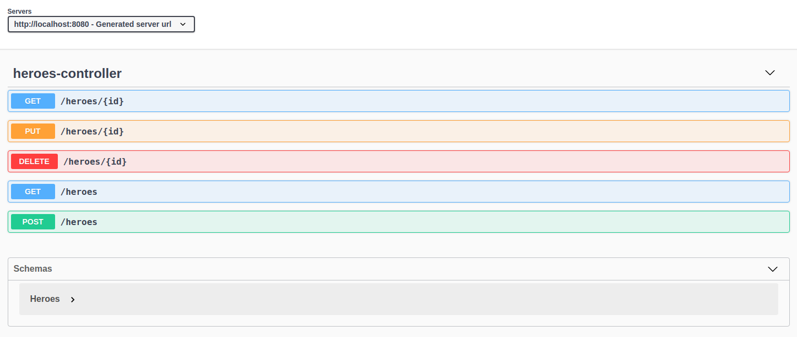

## API reativa com Spring Boot -


## Criando seu gerenciador de super heróis da Marvel e da DC 

Este projeto foi feito baseado nas aulas da Digital Innovation One e pode ser encontrado [aqui](https://github.com/Kamilahsantos/Heroes-SpringWebflux-API), porém fiz algumas modificações e o meu está um pouco diferente do que foi feito em aula.

> Objetivo do projeto: aprender/conhecer a API reativa com Spring Boot.

### **Descrição do projeto**

Nesta sessão vamos desenvolver uma API de gerenciamento de heróis utilizando **Spring WebFlux**, utilizada por empresas como Netflix e Pivotal, junto com a library reativa **Reactor** que atualmente é mantida pela VmWare. Além disso, usaremos o banco DynamoDb localmente para armazenar nossos dados e demonstrarei como realizar testes unitários da sua API com **Junit** e como gerar documentações simples por meio do **Postman** e também do **Swagger**.

> Obs.: Não utilizei o [DynamoDB](https://aws.amazon.com/pt/dynamodb/) da AWS por ser um serviço pago. Então utilizei outro banco NoSQL, o **MongoDB**.

Stack utilizada no projeto:
- Java 11 
- Maven
- IDE Eclipse [STS](https://spring.io/tools)
- Spring WebFlux
- Reactor
- [MongoDB](https://www.mongodb.com) 
- JUnit 
- Swagger
- Postman


DESCRIÇÃO Nesta sessão vamos desenvolver uma API de gerenciamento de heróis utilizando Spring WebFlux, utilizada por empresas como Netflix e Pivotal, junto com a library reativa Reactor que atualmente é mantida pela VmWare. Além disso, usaremos o banco DynamoDb localmente para armazenar nossos dados e demonstrarei como realizar testes unitários da sua API com Junit e como gerar documentações simples por meio do Postman e também do Swagger.

### Solução

A aplicação possui:

1. Tela de Login;
2. Tela de Cadastro;
3. Tela de lista de quadrinhos com infinite loading;
4. Tela de descrição do quadrinho, onde apresenta informações mais detalhadas sobre o mesmo, e que o usuário poderá adiciona-lo ao carrinho;
5. Tela de Carrinho, onde é apresentado a lista de produtos do Cart;
6. Tela de pagamento simulando uso de cartão de crédito;
7. Tela de heróis;
8. Tela de descrição do herói;
9. Tela de perfil;
10. Tela de mudança de senha;
11. Tela de pedidos, onde é apresentado o histórico de compras;
12. Tela de detalhe do pedido;
13. Tela de sobre.

Os dados dos quadrinhos são recuperados da API: [https://developer.marvel.co](https://developer.marvel.com/)

###  Rodar a aplicação

---

Para executar o projeto no terminal, digite o seguinte comando:

```shell script
$ mvn spring-boot:run
```

Após executar o comando acima, o seguinte endereço da API estará disponível:

```
http://localhost:8080/heroes
```

Para executar os testes desenvolvidos, execute o seguinte comando:

```shell script
$ mvn clean test
```

Para visualizar os endpoints da API, usamos o Swagger UI, no endereço:

```
http://localhost:8080/swagger-ui-heroes-reactive-api.html
```

<kbd>
  
</kbd>

### MongoDB

Para utilizar a API você deve ter o MongoDB instalado em sua máquina. Você pode fazer o download [aqui](https://www.mongodb.com/try/download/community), no qual utilizei o "MongoDB Community Server" do *package* "server".

Na documentação há tutoriais de instalação de acordo com seu sistema operacional, [confira aqui](https://docs.mongodb.com/manual/installation/).

Utilizei o Ubuntu 20.04.2 LTS e a seguir há alguns comandos para utilizar o MongoDB:
- Startando o mongodb
    - `$ sudo systemctl start mongod`
- Verificando se iniciou:
    - `$ sudo systemctl status mongod`
- Parando o mongodb
    - `$ sudo systemctl stop mongod`
- Reiniciar o mongodb
    - `$ sudo systemctl restart mongod`

